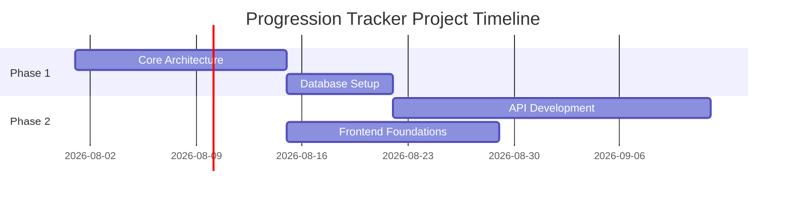

# 55 Sprint 8

**Version:** 1.0.0  
**Last Updated:** 2026-07-05  
**Author:** Product & Engineering Team  

---

## Table of Contents
1. [Overview](#overview)
2. [Details](#details)
3. [Components & Specifications](#components--specifications)
4. [Guidelines](#guidelines)

---

## Overview

This document details the 55 Sprint 8 for Progression Tracker.

## Roadmap & Planning

## Details
Detailed documentation, specifications, and architecture decisions go here. This provides the blueprint for our engineering and design efforts.

## Components & Specifications
- Highly available systems.
- Component reusability.
- Strict typing and robust testing.

## Guidelines
Follow the standard operating procedures defined in the Master Roadmap and Design System guidelines.
